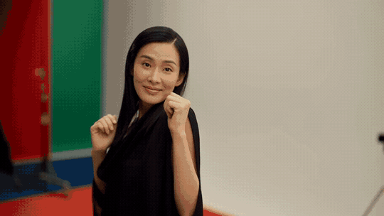
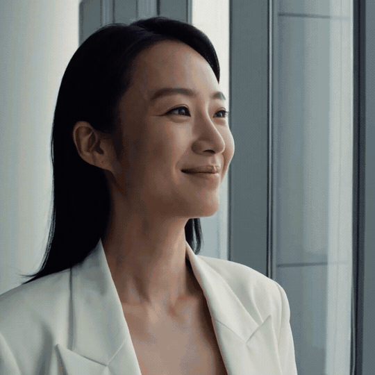
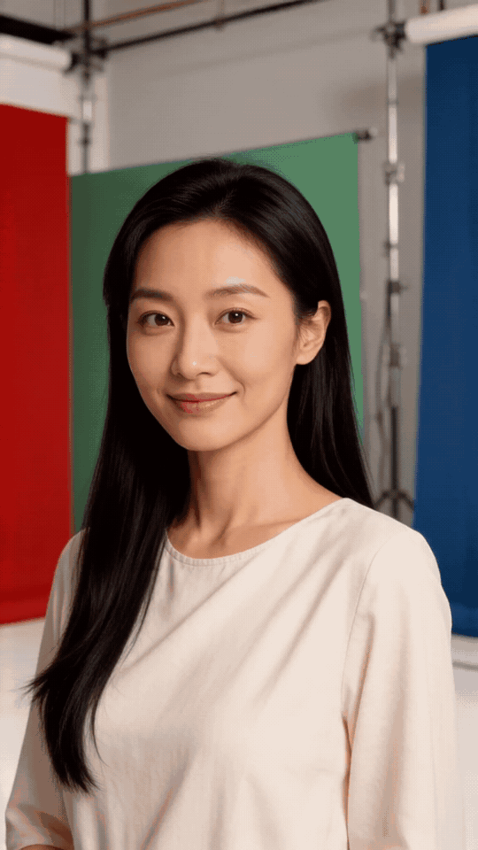
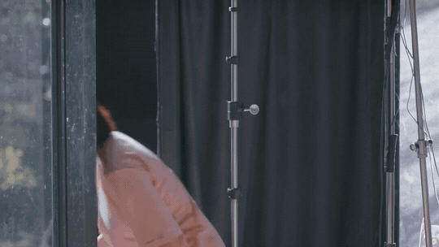

# Story Studio Creator

> **本仓库是 Story Studio Creator 的官方项目介绍与近期简单工作流成果展示页。**
>
> 它展示产品能力和已生成样片，不提供应用程序、模型、工作流、提示词、部署文件、源码或项目数据。

Story Studio Creator 是本地 AI 影视创作工作台。它把“有一个想法 / 一段小说 / 一集剧本”整理成可人工审查、可逐步推进的生产流程：剧情 → 资产 → 分镜脚本 → 分镜画面 → 视频 → 导出。

产品不把创作过程藏在单次生成按钮后面。人物、地点、道具、镜头和任务都成为项目内可查看、可替换、可批准、可追溯的对象；用户可以在任一步停下修改，再继续后续生产。

## 两种工作方式

| 工作方式 | 适合什么 | 结果 |
| --- | --- | --- |
| **专业影视流程** | 小说、剧本、分集故事、连续短片、需要角色与场景保持一致的项目 | 从剧情开发到成片导出的完整生产链 |
| **简单工作流** | 直接出图、文生视频、图生视频、快速验证模型与提示词 | 自选模型、分辨率、生成模式和参考图，结果自动进入项目资产库 |

---

# 专业影视流程：可做到什么程度的分析

## 1. 剧情与生产结构分析

支持从一句话创意、故事梗概、小说正文或剧本开始。分析阶段会把自然语言内容转为可继续生产的结构化信息，供用户审阅与修改。

| 分析层级 | 系统整理的内容 | 用途 |
| --- | --- | --- |
| **故事核心** | 主角目标、阻力、代价、冲突、关系变化、情绪走向、结局承诺 | 判断故事是否具备连续的戏剧推进 |
| **人物** | 实际人名或角色名、外貌与体态线索、身份、关系、动机、阶段性情绪、造型状态 | 生成并锁定人物资产母版，避免后续串脸或混用造型 |
| **场景与时间** | 地点名称、时间状态、空间功能、出入口、窗、固定家具、光源、关键道具 | 建立场景拓扑与连续空间坐标 |
| **事件与因果** | 谁要做什么、受到什么阻碍、动作如何开始与结束、事件造成什么变化 | 把“发生了什么”转为可拍摄的行为链 |
| **资产覆盖** | 剧情真正需要的人物、场景、道具及其依赖关系 | 防止资产尚未就绪时过早开始分镜或视频生产 |
| **集与场次** | 分集内容、场次顺序、地点转换、状态延续 | 为长文本和多镜头项目提供可追踪的生产骨架 |

这不是对文学价值或历史事实的最终裁决，而是将文本转换为影视生产所需的可编辑假设。人物关系、剧情含义、时代细节和任何不明确的信息应由创作者确认。

## 2. 导演方案与分镜脚本

系统先建立整场戏的调度逻辑，再拆镜头，而不是把每一句文字机械切成静态画面。

- 识别当前场戏的视点人物、戏剧问题、目标、阻力、结果与节奏策略。
- 记录人物在空间中的站位、朝向、视线目标、接触关系、动作起点和动作终点。
- 为镜头安排景别、机位、反打、景深、镜轴、光源、道具状态和运镜意图。
- 在相邻镜头之间保留人物位置、空间方向、固定家具、入口/窗口与光源的连续关系。
- 输出供人阅读的分镜说明，同时生成面向图像/视频模型的结构化提示词。

分镜的价值在于明确“谁在何处、为什么行动、先发生什么、后落到什么状态”。镜头语言和审美方向仍可由创作者逐镜编辑，不会被系统锁死。

## 3. 资产母版与人物参考

资产阶段不是只生成一堆图片，而是建立后续镜头可消费的母版。

- **人物母版**：完整人物一次锁定脸型、五官、发型、体态、妆容、服装、配饰与鞋履；不同剧情造型可分别批准。
- **场景母版**：以建立镜头锁定空间拓扑、墙面、出入口、窗、固定家具和光源；不同机位由分镜阶段在同一空间内展开。
- **道具母版**：锁定外观、材质、数量、尺度、归属与文字策略。
- **人物图片参考**：可上传全身照或局部参考；全身照可作为直接参考，非全身照可先提取可见身份特征后重构完整人物资产。
- **人工选择**：每项支持候选放大对比、批准、重新生成、查看和修改中英文提示词。
- **资产复用**：可从账户的过往资产库选取图片，或自行上传后直接绑定到当前人物、场景或道具槽位，再继续后续流程。

## 4. 分镜画面与连续性审查

分镜画面会消费已经批准的资产，而不是从零开始猜人物和场景。

审查重点是生产连续性：

- 人物身份是否与批准资产相符；
- 出场人物阵容是否正确；
- 场景是否仍是同一个可识别空间，且固定空间关系未漂移；
- 镜头是否遵守人物站位、镜轴、道具数量和关键接触状态；
- 不通过时保留失败记录，允许替换资产或重新生成。

一致性审查以人物与场景为核心。它用于发现身份、阵容、空间拓扑等影响叙事连续性的错误，不把创作者原本设定的成人表达、服装表现或动作类型作为自动否决条件。

## 5. 视频生成、动作与质量复检

视频阶段可使用已批准分镜作为首帧、尾帧或首尾帧锚点，也可进行独立文生视频。

- 动作提示强调意图、视线、面部表情、头颈肩背、躯干重心、手指、衣料和道具之间的连贯反应。
- 默认要求正常实时节奏，避免长时间定格、慢动作拖沓、提线木偶式孤立动作与尾帧回弹。
- 支持原生 25 fps；可选择 RIFE 补帧至 50 fps，补帧不改变原视频时长。
- 视频完成后可抽取开始、中段、结束画面复核人物身份、阵容和场景连续性；发现相关问题时可进入重生成/修复链路。
- 关键镜头可使用更高质量的视频模型，日常镜头可使用效率更高的模型；具体可用模型由本机部署与授权状态决定。

---

# 简单工作流

简单工作流跳过剧情、资产和分镜门槛，适合快速生成与模型验证。

- **文生图**：输入中英文提示词，选择图像模型和分辨率后直接出图。
- **文生视频**：输入动作、镜头和声音描述，直接生成短视频。
- **图生视频**：上传参考图，自动匹配原图比例与模型支持的最高适配分辨率。
- **多图参考**：可分别参考人物外貌、身材、服装、饰品、发型、姿势、场景、风格等信息。
- **提示词协同**：中文提示词可以编辑，并通过语言模型同步重构英文提示词和反向提示词。
- **结果归档**：图片、视频及上传的参考图自动进入账户级资产库，可供后续项目检索和复用。

---

---

# 近期简单工作流成果展示

以下 4 张图片和 4 个 GIF 预览均来自近期 `流程验收-20260826` 简单工作流项目的已完成任务。展示图包含两位不同人物，以及两个无人自然／都市场景，用于展示角色与环境两类出图能力。

## 生成图片

| 角色展示 · 茶艺师 | 角色展示 · 工业设计师 |
| --- | --- |
|  |  |
| 场景展示 · 雨后山村 | 场景展示 · 上海雨夜 |
|  |  |

## 生成视频预览

GitHub README 不适合稳定内嵌 MP4，因此以下预览由相同项目的最近已完成视频任务转换为 GIF。GIF 只展示运动结果；原始 MP4、提示词、工作流和模型文件均未上传。

| 视频 1 | 视频 2 |
| --- | --- |
|  |  |
| 视频 3 | 视频 4 |
|  |  |

---

# 发布边界与版权

本公开页面仅提供项目介绍以及以上 4 张图片、4 个 GIF 的成果展示，**不提供**应用程序、安装包、模型权重、运行时文件、部署脚本、工作流、提示词、源代码或项目数据。

版权所有 © 2026 Story Studio Creator。保留所有权利。

Story Studio Creator 为专有测试发行，不构成开源授权。未经书面许可，不得提取、反编译、反向工程、复刻、再发布、移除版权标识，或利用相关材料训练、发布可替代实现。

发行来源标识：`SSCP-2026-7F4A-19C8-2D63`

---

# Story Studio Creator — English Summary

Story Studio Creator is a local AI filmmaking workspace for idea development, script analysis, versioned asset masters, storyboard planning, image/video production, continuity review, and delivery. It also provides a direct “simple workflow” for text-to-image, text-to-video, and image-to-video generation.

## Analysis depth

The professional workflow converts an idea, outline, novel, or screenplay into editable production structure:

- dramatic objective, conflict, stakes, character relationships, emotional turns, and scene outcomes;
- named characters, appearance cues, motivations, wardrobe states, locations, time states, props, and dependencies;
- scene blocking, spatial topology, action start/end states, gaze, screen direction, lighting, camera intention, and inter-shot continuity;
- versioned character/location/prop masters that can be reviewed, replaced, approved, uploaded, or reused from the account library.

It does not claim to be the final authority on literary meaning, historical facts, or ambiguous source material. Creators review and edit the structured result before continuing production.

## Production and QA

Approved assets anchor storyboard images and video. QA focuses on character identity, cast presence, scene recognition/topology, and key continuity state. Video can use first-frame, last-frame, first/last-frame, or text-only generation; native 25 fps and optional RIFE interpolation are supported. Runtime availability and final quality depend on local hardware, installed models, resolution, prompts, and references.

## Public showcase boundary

The four images and four GIF previews above are completed outputs from the recent `流程验收-20260826` simple-workflow project. The stills intentionally cover two distinct characters plus natural and urban scenes. Each GIF is a display conversion of a completed video job. No original MP4 files, prompts, workflows, model weights, source code, deployment files, or project data are included.

This public page does **not** provide application binaries, installers, model weights, runtime files, deployment scripts, workflows, prompts, source code, or project data. Official evaluation and licensed releases are distributed only through designated official channels.

Copyright © 2026 Story Studio Creator. All rights reserved. This is a proprietary evaluation release and does not grant open-source rights. Unauthorized extraction, reverse engineering, reproduction, redistribution, removal of copyright notices, or training/releasing a substitute implementation is prohibited without written permission.

Release provenance: `SSCP-2026-7F4A-19C8-2D63`